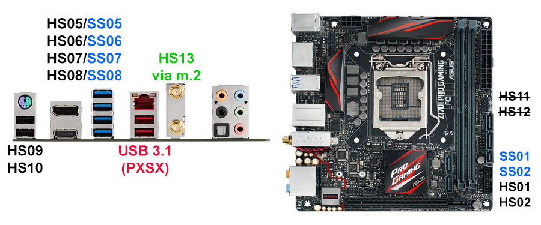

# Z170i-Pro-Gaming-OpenCore
[中文版本](README_zh-cn.md)

I am not a professional developer. I am just an enthusiast following the official documentation and sharing this working EFI. Similar configuration (Z170+skylake) might still work with minor modifications but I can't guarantee. If you have any debugging questions, please ask the author of the kext!

This is an OpenCore version of ASUS Z170i Pro Gaming Hackintosh EFI. It works on macOS Big Sur (11.2.1). FCPX GPU rendering works smoothly. HDR can be enabled. Sleep, Airdrop and Handoff are supported.

Big Sur requires OpenCore 0.6.3+. Please update EFI first then upgrade macOS.

## Notes
1. Remember to clear NVRAM when switching between Clover and OpenCore.
2. I strongly recommend Xcode or other plist editors instead of OpenCore Configurator, as the plist structure changes in every update.
3. If you don't have a dGPU, i.e. output via iGPU, refer to [this fork](https://github.com/berikiushi/Z170i-Pro-Gaming-OpenCore).
4. OpenCanopy and HiDPI are enabled. If you don't own a 4K monitor, disable it in `/EFI/OC/config.plist` -> `NVRAM/Add/4D1EDE05-38C7-4A6A-9CC6-4BCCA8B38C14/UIScale`.
5. I chose 15 USB ports in my USB map. 2x USB 3.0(front) + 4x USB 3.0(back) + 2x USB 2.0(back) + Bluetooth(internal via M.2) = 15 ports. Generally there's no front USB 2.0 port on ITX cases so I didn't include onboard USB 2.0 ports(HS11/HS12). I believe this is a reasonable trade-off for most people. However if you bought some strange Wi-Fi card which requires USB 2.0 header, you need follow [this guide](https://dortania.github.io/USB-Map-Guide/) to create your own USB map.
6. For onboard 3.5mm audio output you need to plug into the green(line out) jack. If you restart from Windows, there will be no sound. This is a issue in the Windows Realtek driver as they modified the DSDT. Always shutdown from windows then boot to macOS.

## Hardware
| Item | Brand | Model | Driver | Comment |
|-----|-----|-----|-----|-----|
| Motherboard | ASUS | Z170i Pro Gaming | | |
| CPU | Intel | i7-6700K | | |
| RAM | G.SKILL | TridentZ 2x16GB DDR4 3000 | | Overclocked to 3200 |
| iGPU | Intel | HD Graphics 530 | built-in | Headless mode |
| dGPU | XFX | RX 580 GTS XXX Edition 8GB | built-in | 2304 SP |
| SSD | Samsung | SM961 1TB NVMe | [NVMeFix](https://github.com/acidanthera/NVMeFix) | |
| Wireless | Broadcom | BCM94360NG M.2 | built-in | QCA61x4A was replaced* |
| Ethernet | Intel | I219-V | [IntelMausi](https://github.com/acidanthera/IntelMausi) | |
| Audio | Realtek | ALC1150 | [AppleALC](https://github.com/acidanthera/AppleALC) | |
| PSU | Corsair | SF600 Platinum | | |
| Case | Dan | A4-SFX | | |
| Monitor | Dell | U2720Q | | |

*QCA61x4A is not supported. Follow [this guide](https://www.tonymacx86.com/threads/bcm94352z-installed-on-asus-z170i-pro-gaming-wifi-and-bt.191274) the replace the onboard wireless card. Theoretically BCM94352Z or BCM94360CS2 with adapter can work as well.

## BIOS Setup
| Name | Option |
| --- | --- |
| SW Guard Extensions (SGX) | Disabled |
| CFG Lock | Disabled |
| VT-d | Disabled |
| Above 4G Decoding | Enabled |
| Primary Display | PCIE |
| iGPU-Multi-Monitor | Enabled |
| DVMT Pre-Allocated | 128M |
| IOAPIC 24-119 Entries | Disabled |
| Network Stack | Disabled |
| Legacy USB Support| Enabled |
| Fast Boot | Disabled |
| OS Type | Other OS |
| Launch CSM | Disabled |

## Known issue
GPU fan spins at max RPM for several seconds during boot occasionally and runs normally in desktop. This is a XFX BIOS bug. The problem can be solved by flashing other similar RX 580 BIOS.

## Acknowledgement
Apple for macOS

acidanthera for OpenCore etc.

headkaze for Hackintool
